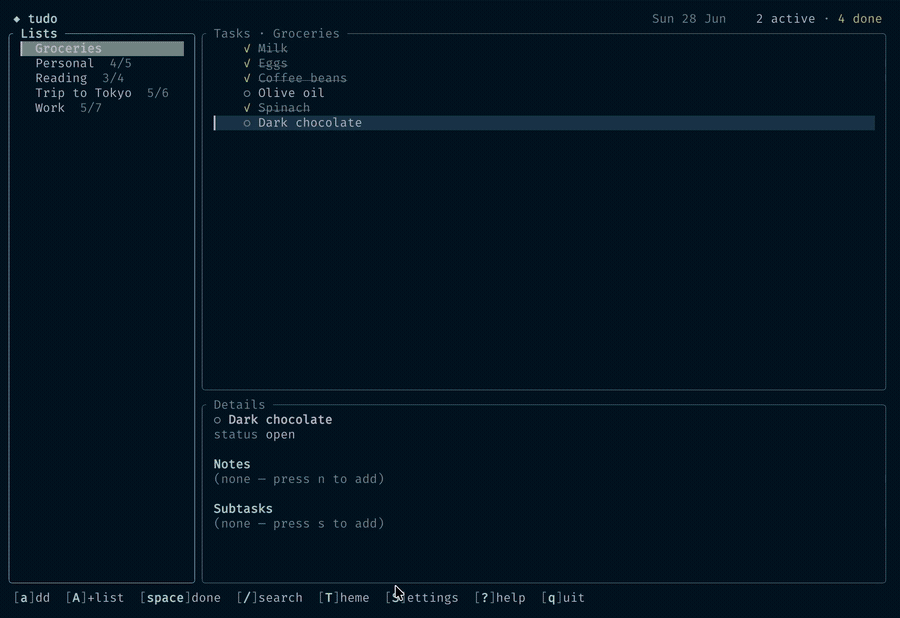

# tudo

A fast, local-first todo list for your terminal. Fully keyboard-driven (with
mouse support), no cloud, no accounts — your tasks are plain JSON files on your
own disk.



## Features

- **Multiple lists / projects** — switch between named lists in the sidebar.
- **Rich tasks** — priority, due date, tags, free-text notes, and one level of
  checkable subtasks.
- **Keyboard first, mouse friendly** — vim keys *and* arrow keys; click rows,
  click a checkbox to toggle, scroll to move.
- **Search & filter** — substring search across titles/tags/notes and a
  status filter (all / active / done).
- **Human-readable storage** — one pretty-printed JSON file per list, written
  atomically so a crash can't corrupt your data.
- **Local-first** — nothing leaves your machine.

## Install

### Quick install (prebuilt binary)

macOS and Linux — no Rust toolchain needed:

```sh
curl -fsSL https://raw.githubusercontent.com/jolleydesign/tudo/main/install.sh | sh
```

This grabs the right binary for your platform from the latest
[release](https://github.com/jolleydesign/tudo/releases) and installs it to
`~/.local/bin`. Set `TUDO_INSTALL_DIR` to install somewhere else, or
`TUDO_VERSION` (e.g. `v0.1.0`) to pin a specific version.

### With Cargo

If you have a Rust toolchain (1.95+):

```sh
# straight from GitHub
cargo install --git https://github.com/jolleydesign/tudo

# or from a local checkout
cargo install --path .

# or just build and run
cargo run --release
```

`cargo install` puts a `tudo` binary on your `PATH` (usually `~/.cargo/bin`).

## First run

The first time you launch `tudo`, it asks where to keep your data and offers a
few standard locations (or a custom path). Your choice is remembered in a tiny
pointer file at `~/.config/tudo/config.json`. A starter list named **Tasks** is
created so you can begin immediately.

## Keybindings

| Key | Action |
|-----|--------|
| `Tab`, `h`/`l`, `←`/`→` | switch focus between the Lists and Tasks panes |
| `j`/`k`, `↑`/`↓` | move the selection |
| `Space` | toggle the selected task (or subtask) done |
| `Enter` | open a task's detail view / drill into a list |
| `a` / `A` | add a task / add a list |
| `e` | edit the selected title |
| `d` | delete the selected item (asks to confirm) |
| `p` | cycle priority (none → low → med → high) |
| `D` | set or clear the due date |
| `t` | edit tags |
| `n` | edit notes (multi-line: `Enter` for a newline, `Ctrl+S` to save) |
| `s` | add a subtask |
| `/` | search (titles, tags, notes) |
| `f` | cycle the status filter (all / active / done) |
| `T` | open the theme picker |
| `S` | open settings (paths, data location) |
| `Esc` | close a dialog / leave detail / clear the filter |
| `?` | show the help overlay |
| `q`, `Ctrl+C` | quit |

**Due-date input** accepts `YYYY-MM-DD`, `today`, `tomorrow`, or `+N` (N days
from today). An empty value clears the date.

**Mouse:** click a list or task to select it, click a task's checkbox to toggle
it done, and use the scroll wheel to move within the focused pane.

## Themes

Press `T` to open the **theme picker**: browse with `↑/↓` to preview each theme
live across the whole UI, `Enter` to apply, `Esc` to revert. Eleven palettes are
built in — **Tokyo Night** (default), **Catppuccin Mocha**, **Dracula**,
**Nord**, **Gruvbox Dark**, **Solarized Dark**, **One Dark**, **Rosé Pine**,
**Gotham**, **Black & White**, and **Terminal**. Your choice is remembered in
the config pointer.

The coloured themes are truecolor, so they look the same regardless of your
terminal's own theme; **Terminal** does the opposite — it forces no background
and uses the 16 ANSI colours, so the app adopts your terminal's scheme. Set
`TUDO_THEME` (e.g. `TUDO_THEME=dracula` or `TUDO_THEME=none`) to override the
theme for a single run.

## Settings & configuration

Press `S` to open the settings panel, which shows your **data directory**, the
**config file** path, the storage format, the active theme, your list/task
counts, and any environment overrides currently in effect.

Configuration is a small **JSON** file (not TOML) — `~/.config/tudo/config.json`
by default (override with `$TUDO_CONFIG`). It holds just the `data_dir` and
`theme`; everything else (your actual lists) lives as separate JSON files in the
data directory. To move your data, press `S` then `d`, type a new path (`~` is
allowed), and `Enter` — tudo moves your list files there and repoints the config.

## Storage format

Each list is a single JSON file (`<slug>.json`) in your data directory:

```json
{
  "name": "Work",
  "tasks": [
    {
      "id": "f7c1…",
      "title": "Ship the TUI",
      "done": false,
      "priority": "high",
      "due": "2026-07-01",
      "tags": ["rust", "urgent"],
      "notes": "the big one",
      "subtasks": [
        { "id": "a2…", "title": "data model", "done": true }
      ],
      "created": "2026-06-28T14:40:00Z",
      "completed_at": null
    }
  ]
}
```

Edit these by hand or keep them in a git repo — they're just text.

## Environment variables

- `TUDO_DIR` — override the data directory (skips the saved config; great for
  scoping tasks to a project or for scripting).
- `TUDO_CONFIG` — override the location of the config pointer file.
- `TUDO_THEME` — override the theme for one run (`tokyo-night`, `catppuccin`,
  `dracula`, `nord`, `gruvbox`, `solarized`, `one-dark`, `rose-pine`, `gotham`,
  `black-white`, or `none`/`terminal`).

## Development

```sh
cargo test       # unit + headless render tests (no real terminal needed)
cargo clippy --all-targets
cargo run
```

Source layout: `model` (types), `storage` (JSON I/O), `config` (data-dir
resolution), `app` (state + actions), `event` (key/mouse mapping), `ui`
(rendering). The action logic and rendering are terminal-free, so they're tested
directly with `tempfile` and ratatui's `TestBackend`.
